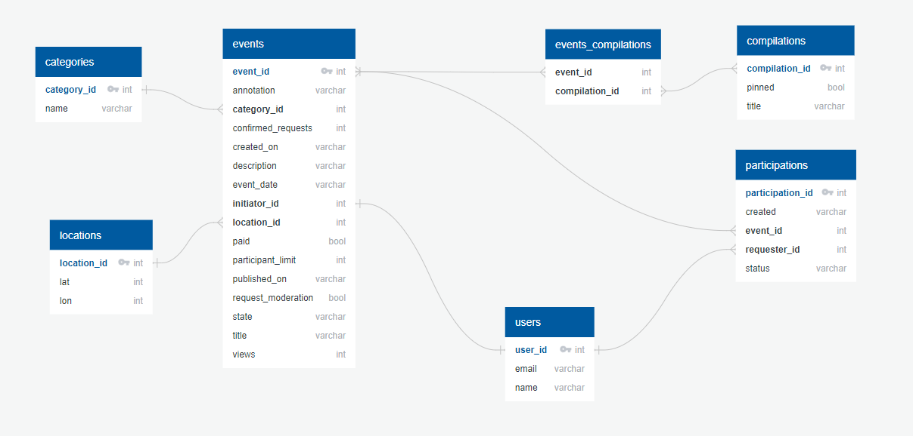
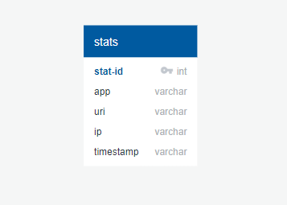

***
### Ссылка на [Pull request](https://github.com/OldSorcer/java-explore-with-me/pull/1).
***
# *Explore With Me*

## *Описание*
***
**Explore with me** - это афиша, где можно разместить какое-либо событие от похода в кино
до выставки и набрать компанию для участия в нем.

Все добавленные пользователями ***события*** могут быть разделены по ***категориям***, например:
* Концерты;
* Музеи;
* Кино и т.п.

А так же сгруппированы в ***подборках*** по различным категориям, местам проведения
 мероприятия или любому другому критерию.

Приложение состоит из двух ***микро-сервисов:***
1. Сервис с основной функциональностью приложения;
2. Сервис ***статистики***.

## *Используемые технологии и бибилиотеки*
***
* Spring Boot v. 2.7.2;
* Spring Boot Data JPA v. 2.7.2;
* Lombok v. 1.18.24;
* PostgreSQL v. 42.5.0;
* QueryDSL v. 5.0.0;
* Apache HTTPClient v.4.5.13;

## *Основной сервис EWM*
***
В приложении представлена следующая основная ***функциональность***:
* Возможность добавлять новое ***событие***;
* Возможность редактировать уже добавленное ***событие***;
* Просматривать ***события*** добавленные как другими пользователями, 
 так и созданные самим пользователем с возможностью фильтрации;
* Разделение ***событий*** по ***категориям***;
* Объединение событий в ***подборки***;
* Возможность создания ***запроса на участие*** в ***событии***;
* Создание, удаление и получение списка ***пользователей***;

## *Сервис статистики*
***
Сервис статистики позволяет сохранять статистику обращения к
конкретному ***событию*** и получать информацию о количестве 
как ***уникальных просмотров***, так и их общее количество.

## *Схемы баз данных*
***
### 1. База данных основного сервиса.


### 2. База данных сервиса статистики.


## *Спецификация*
***
**Спецификация API** основного сервиса "EWM" описана в файле [**ewm-main-service-spec.json**](https://raw.githubusercontent.com/OldSorcer/java-explore-with-me/main/ewm-main-service-spec.json).

**Спецификация API** сервиса статистики "Stats" описана в файле [**ewm-stats-service-spec.json**](https://raw.githubusercontent.com/OldSorcer/java-explore-with-me/main/ewm-stats-service-spec.json).


> Для просмотра спецификации можно использовать [***Swagger-Editor***](https://editor-next.swagger.io/).

## *Запуск приложения*
***
* Необходимо склонировать текущий репозиторий используя ***Git***

``` 
git clone https://github.com/OlSorcer/java-explore-with-me.git
```
* Перейти в директорию, которая содержит **склонированный репозиторий** используя командную строку

```
cd [путь_до_репозитория]
```
* Скомпилировать и создать исполняемые **.jar** файлы
```
mvn package
```
* Используя **Docker Desktop** необходимо запустить контейнеры воспользовавшись **Docker Compose**.
````
docker-compose up
````